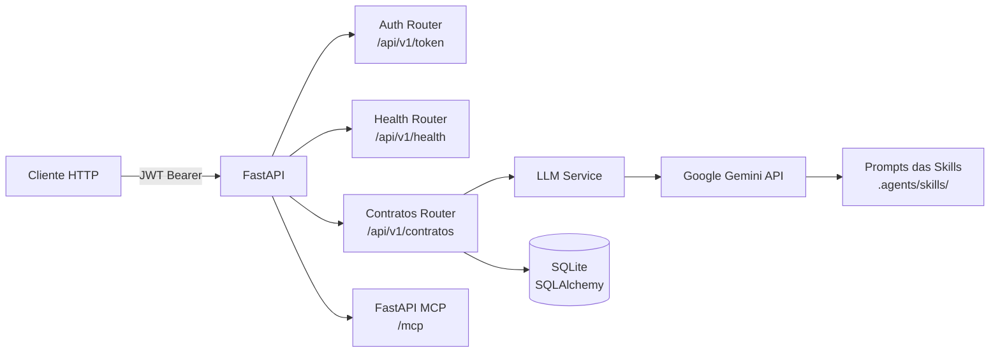
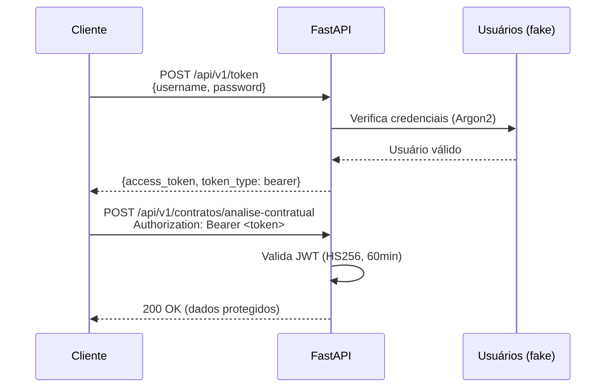
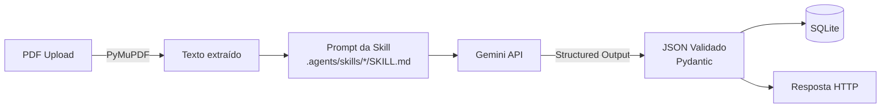

# API de Gestão e Análise Contratual com Inteligência Artificial

    

Trabalho final da disciplina **Construção de APIs para Inteligência Artificial**, sob orientação do prof. **Rogério Rodrigues Carvalho**.

API em FastAPI que encapsula agentes (skills) baseados em LLM para automatizar triagem, mapeamento e análise de riscos de contratos industriais complexos (padrão Petronect/Petrobras).

---

## Arquitetura do Projeto

```
fastapi_contratos/
├── api/
│   ├── main.py                  # App FastAPI, migrações automáticas, MCP mount
│   ├── database.py              # SQLAlchemy engine + SessionLocal
│   ├── db_models.py             # Modelos ORM (3 tabelas)
│   ├── models.py                # Schemas Pydantic (request/response)
│   ├── utils.py                 # Logger, cliente Gemini com fallback
│   ├── biblioteca_api.py        # Cliente Python para consumir a API
│   ├── routers/
│   │   ├── contratos_router.py  # Endpoints de análise contratual
│   │   ├── auth_router.py       # Autenticação JWT (OAuth2)
│   │   └── health_router.py     # Health check
│   ├── services/
│   │   └── llm_service.py       # Extração de texto PDF + chamadas Gemini
│   └── docs/
│       └── padroes_de_desenvolvimento.md
├── .agents/skills/
│   ├── analisador-contratual/SKILL.md
│   ├── ingestao-metadados/SKILL.md
│   └── reconhecimento-estratificacao/SKILL.md
├── contratos-para-teste/          # PDFs para testes
│   ├── Contrato 2 - Assinado.pdf
│   ├── Contrato 3 - Assinado.pdf
│   ├── Contrato 4 - Assinado.pdf
│   └── Contrato 5 - Assinado.pdf
├── specs/                        # Documentos de especificação
├── pyproject.toml                # Dependências (uv)
├── contratos.db                  # SQLite (criado automaticamente)
└── .env.sample                   # Template de variáveis de ambiente
```



---

## Stack Tecnológico

| Tecnologia        | Versão                          | Propósito                            |
| :---------------- | :------------------------------ | :----------------------------------- |
| Python            | >= 3.12                         | Runtime                              |
| FastAPI           | >= 0.136                        | Framework web REST                   |
| SQLAlchemy        | >= 2.0                          | ORM + migrações                      |
| SQLite            | -                               | Banco de dados embarcado             |
| Google Gemini API | 2.5 Flash / 2.0 Flash / 2.5 Pro | LLM para análise contratual          |
| PyMuPDF (fitz)    | >= 1.27                         | Extração de texto de PDFs            |
| PyJWT             | >= 2.13                         | Tokens de autenticação               |
| PwdLib (Argon2)   | >= 0.3                          | Hash de senhas                       |
| uv                | -                               | Gerenciador de dependências          |
| FastAPI MCP       | >= 0.4                          | Exposição via Model Context Protocol |
| Ruff              | >= 0.15                         | Linter e formatador                  |

---

## Referência Completa de Endpoints

### Autenticação

| Método | Rota             | Descrição                             |
| :----- | :--------------- | :------------------------------------ |
| `POST` | `/api/v1/token`  | Gera token JWT (OAuth2 Password Flow) |
| `GET`  | `/api/v1/health` | Health check da API                   |

### Análise de Contratos (IA) — Criação

| Método | Rota                                              | Descrição                                                                       |
| :----- | :------------------------------------------------ | :------------------------------------------------------------------------------ |
| `POST` | `/api/v1/contratos/reconhecimento-estratificacao` | Mapeia intervalos de páginas de cada seção do PDF e extrai o número do contrato |
| `POST` | `/api/v1/contratos/ingestao-metadados`            | Extrai metadados cadastrais (contratante, contratada, objeto, prazos, valor)    |
| `POST` | `/api/v1/contratos/analise-contratual`            | Extrai cláusulas de multas, penalidades, sanções e vigência                     |

### Consultas Gerais

| Método | Rota                                              | Descrição                  | Filtros                              |
| :----- | :------------------------------------------------ | :------------------------- | :----------------------------------- |
| `GET`  | `/api/v1/contratos/reconhecimento-estratificacao` | Lista estratificações      | `numero_contrato`                    |
| `GET`  | `/api/v1/contratos/ingestao-metadados`            | Lista metadados            | `numero_contrato`, `contratada`      |
| `GET`  | `/api/v1/contratos/analises`                      | Lista análises contratuais | `empresa`, `cnpj`, `numero_contrato` |

### Consultas Específicas

| Método | Rota                                                   | Descrição                      |
| :----- | :----------------------------------------------------- | :----------------------------- |
| `GET`  | `/api/v1/contratos/reconhecimento-estratificacao/{id}` | Detalhes de uma estratificação |
| `GET`  | `/api/v1/contratos/ingestao-metadados/{id}`            | Detalhes de metadados          |
| `GET`  | `/api/v1/contratos/analises/{id}`                      | Detalhes de uma análise        |

### Edição (PATCH)

| Método  | Rota                                                   | Descrição                         |
| :------ | :----------------------------------------------------- | :-------------------------------- |
| `PATCH` | `/api/v1/contratos/analises/{id}`                      | Atualiza campos de uma análise    |
| `PATCH` | `/api/v1/contratos/ingestao-metadados/{id}`            | Atualiza metadados cadastrais     |
| `PATCH` | `/api/v1/contratos/reconhecimento-estratificacao/{id}` | Atualiza seções da estratificação |

### Exclusão (DELETE)

| Método   | Rota                                                   | Descrição                               |
| :------- | :----------------------------------------------------- | :-------------------------------------- |
| `DELETE` | `/api/v1/contratos/analises/{id}`                      | Exclui análise (`?confirm=true`)        |
| `DELETE` | `/api/v1/contratos/ingestao-metadados/{id}`            | Exclui metadados (`?confirm=true`)      |
| `DELETE` | `/api/v1/contratos/reconhecimento-estratificacao/{id}` | Exclui estratificação (`?confirm=true`) |

> Todos os endpoints `/api/v1/contratos/*` exigem autenticação Bearer JWT.

---

## Fluxo de Autenticação



| Campo         | Valor                  |
| :------------ | :--------------------- |
| **Token URL** | `POST /api/v1/token`   |
| **Esquema**   | OAuth2 Password Bearer |
| **Algoritmo** | HS256                  |
| **Expiração** | 60 minutos             |
| **Username**  | `johndoe`              |
| **Password**  | `secret`               |

---

## Banco de Dados (SQLite)

O banco `contratos.db` é criado automaticamente na inicialização. Três tabelas são gerenciadas pelo SQLAlchemy:

### `analises_contratuais`

Armazena os resultados da análise de cláusulas de penalidades e vigência.

| Coluna                    | Tipo         | Descrição                 |
| :------------------------ | :----------- | :------------------------ |
| `id`                      | INTEGER (PK) | Identificador único       |
| `empresa`                 | VARCHAR      | Nome da contratada        |
| `cnpj`                    | VARCHAR      | CNPJ (com pontuação)      |
| `data_inicio`             | DATE         | Início da vigência        |
| `data_fim`                | DATE         | Término calculado         |
| `vigencia_prazo`          | INTEGER      | Prazo em dias             |
| `valor_contrato`          | VARCHAR      | Valor global              |
| `clausula_vigencia`       | TEXT         | Cláusula literal          |
| `multas_moratorias`       | TEXT         | Cláusula literal          |
| `multas_compensatorias`   | TEXT         | Cláusula literal          |
| `sancoes_administrativas` | TEXT         | Cláusula literal          |
| `rescisao`                | TEXT         | Cláusula literal          |
| `numero_contrato`         | VARCHAR      | Identificador do contrato |
| `numero_oportunidade`     | VARCHAR      | Oportunidade Petronect    |
| `data_insercao`           | DATETIME     | Timestamp de criação      |

### `ingestao_metadados`

Armazena os metadados cadastrais extraídos do contrato.

| Coluna                | Tipo         | Descrição                 |
| :-------------------- | :----------- | :------------------------ |
| `id`                  | INTEGER (PK) | Identificador único       |
| `numero_contrato`     | VARCHAR      | Número do contrato        |
| `numero_oportunidade` | VARCHAR      | Oportunidade Petronect    |
| `objeto_contrato`     | TEXT         | Objeto do contrato        |
| `contratante`         | VARCHAR      | Entidade contratante      |
| `contratada`          | VARCHAR      | Empresa contratada        |
| `prazo_vigencia`      | INTEGER      | Prazo em dias             |
| `prazo_execucao`      | INTEGER      | Prazo de execução em dias |
| `valor_total`         | VARCHAR      | Valor global              |
| `data_insercao`       | DATETIME     | Timestamp de criação      |

### `reconhecimento_estratificacao`

Armazena o mapeamento de páginas de cada seção do contrato.

| Coluna            | Tipo         | Descrição                            |
| :---------------- | :----------- | :----------------------------------- |
| `id`              | INTEGER (PK) | Identificador único                  |
| `numero_contrato` | VARCHAR      | Número do contrato                   |
| `*_inicio`        | INTEGER      | Página inicial da seção              |
| `*_fim`           | INTEGER      | Página final da seção                |
| `*_tipo`          | VARCHAR      | Tipo (Texto/Imagens/Texto + Imagens) |
| `data_insercao`   | DATETIME     | Timestamp de criação                 |

Seções mapeadas: `relatorio_assinatura`, `instrumento_contratual_icj`, `especificacao_tecnica_memorial`, `planilha_precos_ppu`, `anexo_sms`, `circulares_conformidade`.

---

## Pipeline de IA



### Como funciona

1. **Upload do PDF** validado (formato `.pdf`, máximo 50 MB)
2. **Extração de texto** via PyMuPDF (valida se o PDF é pesquisável)
3. **Prompt Engineering**: o texto é combinado com as instruções da skill (`.agents/skills/*/SKILL.md`)
4. **Chamada ao Gemini**: Structured Outputs com schema Pydantic garantem JSON tipado
5. **Fallback automático**: em caso de rate limit (429), tenta modelos alternativos na ordem:
   - `gemini-2.5-flash` (primário)
   - `gemini-2.0-flash` (1º fallback)
   - `gemini-2.5-pro` (2º fallback)
6. **Persistência** dos dados validados no SQLite

### Skills disponíveis

| Skill                           | Arquivo                                                 | Endpoint                                 |
| :------------------------------ | :------------------------------------------------------ | :--------------------------------------- |
| Reconhecimento e Estratificação | `.agents/skills/reconhecimento-estratificacao/SKILL.md` | `POST .../reconhecimento-estratificacao` |
| Ingestão de Metadados           | `.agents/skills/ingestao-metadados/SKILL.md`            | `POST .../ingestao-metadados`            |
| Analisador Contratual           | `.agents/skills/analisador-contratual/SKILL.md`         | `POST .../analise-contratual`            |

---

## Biblioteca Cliente Python

O módulo `api/biblioteca_api.py` fornece a classe `BibliotecaAPI` para consumir a API programaticamente:

```python
from biblioteca_api import BibliotecaAPI

api = BibliotecaAPI(base_url="http://localhost:8000")

# Autentica
api.login(username="johndoe", password="secret")

# Envia contrato para análise
resultado = api.analise_contratual("caminho/para/contrato.pdf")
print(resultado["analise"])

# Consulta análises salvas
analises = api.listar_analises(empresa="PETROBRAS")
```

Métodos disponíveis:

| Método                                          | Descrição                             |
| :---------------------------------------------- | :------------------------------------ |
| `login(username, password)`                     | Autentica e armazena token JWT        |
| `analise_contratual(file_path)`                 | Envia PDF para análise de penalidades |
| `reconhecimento_estratificacao(file_path)`      | Mapeia seções do PDF                  |
| `ingestao_metadados(file_path)`                 | Extrai metadados cadastrais           |
| `listar_analises(empresa, cnpj)`                | Lista análises persistidas            |
| `obter_analise(id_analise)`                     | Detalhes de uma análise               |
| `listar_estratificacoes(numero_contrato)`       | Lista estratificações                 |
| `obter_estratificacao(id)`                      | Detalhes de uma estratificação        |
| `listar_metadados(numero_contrato, contratada)` | Lista metadados                       |
| `obter_metadados(id)`                           | Detalhes de metadados                 |

---

## Integração MCP (Model Context Protocol)

A API expõe automaticamente todos os endpoints como ferramentas MCP via `FastApiMCP`:

```
mcp = FastApiMCP(app)
mcp.mount_http()
```

Isso permite que agentes compatíveis com MCP (LangChain, Claude, etc.) consumam a API como um conjunto de ferramentas. O endpoint MCP fica disponível em `/mcp`.

---

## Tratamento de Erros

| Status  | Quando ocorre                                                                                         |
| :------ | :---------------------------------------------------------------------------------------------------- |
| **400** | PDF inválido/corrompido, tamanho > 50 MB, filtro com menos de 14 dígitos, exclusão sem `confirm=true` |
| **401** | Token JWT ausente, expirado ou inválido                                                               |
| **404** | ID solicitado não encontrado no banco                                                                 |
| **422** | Validação de tipos pelo FastAPI/Pydantic (ex: `id` não numérico)                                      |
| **502** | Falha de comunicação com a API do Gemini (após 3 tentativas com fallback)                             |

---

## Validações e Regras de Robustez

- **Prazos em dias**: Todos os prazos (vigência, execução) são armazenados como inteiros positivos em dias
- **Sanitização inteligente**: Buscas ignoram pontuação (`.` `-` `/`), espaços e prefixo `ICJ` — tanto no input quanto no banco
- **Validação de 14 dígitos**: Filtros de `numero_contrato` e `cnpj` exigem exatamente 14 dígitos numéricos
- **Upload seguro**: Apenas PDF, máximo 50 MB
- **DELETE protegido**: Requer `?confirm=true` na query string
- **Pagination implícita**: Resultados ordenados por `data_insercao` decrescente
- **Logging**: Todos os acessos e erros são registrados com timestamp

---

## Como Executar Localmente

### Pré-requisitos

- Python 3.12+
- [uv](https://docs.astral.sh/uv/) (gerenciador de dependências)
- Chave de API do Google Gemini ([obter aqui](https://aistudio.google.com/apikey))

### 1. Configurar ambiente

```bash
cp .env.sample .env
```

Edite o arquivo `.env` e preencha:

```
GEMINI_API_KEY=sua_chave_aqui
```

### 2. Instalar dependências

```bash
uv sync
```

### 3. Iniciar servidor

```bash
uv run fastapi dev api/main.py
```

O banco SQLite `contratos.db` é criado automaticamente na primeira execução, com migrações automáticas de colunas.

### 4. Acessar documentação

- **Swagger UI**: http://localhost:8000/docs
- **ReDoc**: http://localhost:8000/redoc

### Credenciais de teste

| Campo    | Valor     |
| :------- | :-------- |
| Username | `johndoe` |
| Password | `secret`  |

Clique em **Authorize** no Swagger e informe os dados acima para obter o token JWT.

### Contratos de Teste

A pasta [`contratos-para-teste/`](contratos-para-teste/) contém 4 contratos em PDF para testar os endpoints de análise sem precisar buscar documentos externos.

---

## Guia de Desenvolvimento

### Commits (Conventional Commits)

```
<tipo>(escopo): <descrição>

exemplos:
feat(api): endpoint para autenticação
fix(db): corrige migração de colunas
docs: atualiza README com novos endpoints
```

Tipos: `feat`, `fix`, `refactor`, `style`, `test`, `docs`, `chore`, `build`, `perf`, `ci`, `revert`

### Pre-commit hooks

```bash
pip install pre-commit
pre-commit install
pre-commit run --all-files   # executar manualmente
```

Hooks configurados: ruff (lint + formatação), detect-private-key, trailing-whitespace, check-docstring-first, end-of-file-fixer.

### Branches (Git Flow)

- `main` — versão de produção
- `feat/#id-descricao` — novas funcionalidades
- `fix/#id-descricao` — correções

### Lint

```bash
ruff check .
ruff format .
```

> Documentação completa em `api/docs/padroes_de_desenvolvimento.md`

---

## Licença

Distribuído sob licença Apache 2.0.

---

## Contato

| Nome                | Papel                                                     |
| :------------------ | :-------------------------------------------------------- |
| José Allan          | joseallan@ufg.br / joseallan@gmail.com                    |
| Elson               | elson_manoel@yahoo.com.br / elson.andrade@discente.ufg.br |
| Paulo Henrique (PH) | phenriquiu@gmail.com / ferreira.henrique@discente.ufg.br  |
| Geiziane            | geizianeoliveira@discente.ufg.br                          |

Repositório: https://github.com/joseallangoncalves/fastapi_contratos
